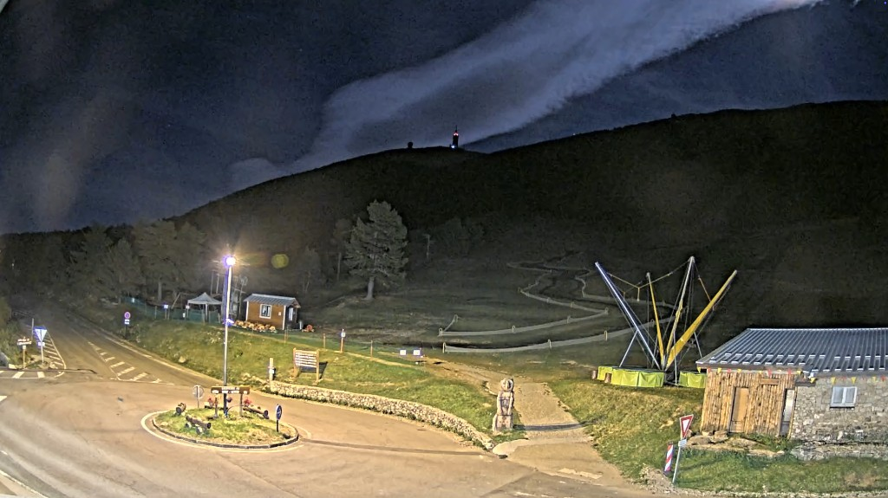

# Mont Serein — veille

Le Raspberry Pi 5 regarde la webcam du Mont Serein. Chaque mouvement est gardé et interprété avec le jour, la nuit et la météo. Un avion, une voiture, un bus ou un incendie ne sont nommés que lorsque la lecture est assez sûre. Le site est [medialoco.github.io/ventoux-watch](https://medialoco.github.io/ventoux-watch/).

Le flux est celui déjà utilisé par [dataroads-fr84.info](https://dataroads-fr84.info/), source Vision-Environnement. Le site affiche ce direct. Il ne réhéberge pas la vidéo continue.



*24 septembre 2026, 23:41, heure de Paris. La photo a été prise à 14:41 à Los Angeles.*

Hashtags : #MontSerein #MontVentoux #Vaucluse #Webcam #VisionParOrdinateur

## Pipeline

1. Une image par seconde, différence avec le fond (OpenCV MOG2). Une tache compacte qui se déplace devient un passage. Un changement de lumière sur toute l’image est ignoré. La balise rouge du sommet est masquée dans `config/zones.json`.
2. YOLO nano, en ONNX, seulement sur le rectangle de ce passage.
3. Une règle pose le nom. Sans nom, la ligne reste dans `data/candidates.jsonl` sur le Pi et n’entre pas dans l’historique.

Un avion n’est publié avec son indicatif que s’il n’y en a qu’un dans le créneau OpenSky, ou un seul vraiment plus bas que les autres. Un bus prend le nom de la ligne Trans'CoVe ou ZOU seulement s’il n’y a qu’une course à ±15 minutes. Les autres passages restent dans l’historique avec une lecture : jour ou nuit, météo, et ce qu’on a pu en dire. Une lueur au crépuscule n’est pas un incendie. Les animaux ne sont pas encore une classe.

Cette caméra devient plus familière avec le temps. Le jour, la nuit et la météo changent la lecture. Les passages sont gardés, photo comprise. Un coin qui bouge souvent pour rien, compté dans `data/learning.json`, finit par être traité comme une habitude.

## Sur le Mac, avant le Pi

```bash
uv venv --python 3.12 .venv
uv pip install --python .venv/bin/python -r requirements.txt
uv pip install --python .venv/bin/python -r requirements-export.txt
.venv/bin/python scripts/export_model.py
.venv/bin/python -m unittest discover -s tests -v
```

`models/yolo11n.onnx` part avec le code. Le Pi n’installe pas PyTorch.

Les zones sont dessinées sur l’image de nuit `data/reference.jpg` :

```bash
.venv/bin/python scripts/draw_zones.py
```

Le fichier `data/zones-preview.jpg` sert à les corriger. Les coordonnées dans `config/zones.json` vont de 0 à 1.

La veille se lance par `./scripts/mac_veille.sh`, jamais à la main en arrière-plan : lancée depuis un terminal, elle meurt avec lui, et `nohup` n’y change rien. Le script la détache dans sa propre session. Voir [`incidents.md`](incidents.md).

## Sur le Pi

Une seule commande, rejouable sans rien casser :

```bash
ssh ventoux 'bash -s' < scripts/pi_install.sh
```

Elle installe les paquets, crée la clé de déploiement, clone le dépôt dans `/opt/ventoux-watch`, monte le service systemd et met en place le redémarrage autonome. Le script s’arrête et affiche la clé publique tant qu’elle n’est pas déclarée en écriture sur le dépôt.

Les secrets ne sont pas copiés par le script. Il faut porter `config/local.json` à la main, une fois, et il reste hors du dépôt :

```json
{
  "opensky": {"client_id": "...", "client_secret": "..."},
  "drive": {"credentials": "secrets/drive.json", "folder_id": "..."}
}
```

OpenSky et Drive sont facultatifs. Sans compte OpenSky, l’archive des avions reste anonyme et plus limitée. Sans clé Drive, les photos sont publiées, pas les extraits. Pour les extraits : `pip install -r requirements-drive.txt`, un compte de service, et le dossier Drive partagé avec ce compte.

Un départ de feu est publié immédiatement ; tout le reste est groupé et poussé au plus toutes les quinze minutes. GitHub Pages reconstruit le site : [https://medialoco.github.io/ventoux-watch/](https://medialoco.github.io/ventoux-watch/).

Le matériel, la carte SD, le disque externe, le chien de garde et les secrets sont décrits dans [`infra.md`](infra.md). Les pannes et les périodes où la montagne n’était regardée par personne sont tenues dans [`incidents.md`](incidents.md).

## Voir le site en local

```bash
mkdir -p _site/data/thumbs
cp -R site/. _site/
cp data/events.json _site/data/events.json
cp config/relief.json _site/data/relief.json
cp -R data/thumbs/. _site/data/thumbs/
.venv/bin/python -m http.server 8765 --directory _site
```
